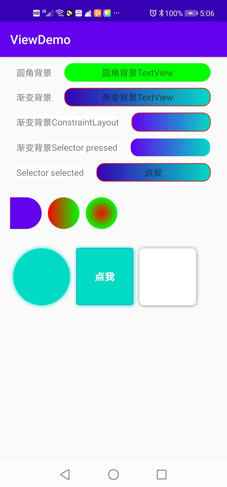

# XWidget

### 一个扩展的控件库，扩展了一些常用控件的属性，减少开发过程中的drawable文件膨胀。

## 示例

## 支持的控件
`XButton, XConstraintLayout, XEditText, XFrameLayout, XImageView, XLinearLayout, XRelativeLayout, XTextView `...

## 支持属性名称
| 属性名称 | 示例
--------| ---
**XButton_corner**|**圆角度数**
**XButton_corner_type**|**圆角类型，默认 all。left_top,left_bottom,right_top,right_bottom**
**XButtonCustom_solid_color**|**背景填充颜色，当没有设置渐变填充时生效**
**XButtonCustom_shadow_color**|**外阴影色值**
**XButtonCustom_shadow_radius**|**外阴影半径**
**XButtonCustom_shadow_dx**|**外阴影x方向偏移**
**XButtonCustom_shadow_dy**|**外阴影y方向偏移**
**XButtonCustom_solid_gradient**|**渐变类型，linear or sweep**
**XButtonCustom_gradient_start_color**|**渐变起始颜色**
**XButtonCustom_gradient_end_color**|**渐变结束颜色**
**XButtonCustom_gradient_orientation**|**渐变的方向**
**XButtonCustom_gradient_radius**|**渐变角度**
**XButtonCustom_stroke_color**|**描边颜色**
**XButtonCustom_stroke_border**|**描边宽度**
**XButtonCustom_state**|**selector类型，默认none。pressed, selected, checked。选定上述状态时，触发state前缀的属性**
**XButtonCustom_stated_corner**|**state触发的圆角**
**XButton_corner_type**|**state触发时的圆角类型，默认 all。left_top,left_bottom,right_top,right_bottom**
**XButtonCustom_stated_solid_color**|**state出发时背景填充颜色，当没有设置渐变填充时生效**
**XButtonCustom_stated_shadow_color**|**外阴影色值**
**XButtonCustom_stated_shadow_radius**|**外阴影半径**
**XButtonCustom_stated_shadow_dx**|**外阴影x方向偏移**
**XButtonCustom_stated_shadow_dy**|**外阴影y方向偏移**
**XButtonCustom_stated_solid_gradient**|**渐变类型，linear or sweep**
**XButtonCustom_stated_gradient_start_color**|**渐变起始颜色**
**XButtonCustom_stated_gradient_end_color**|**渐变结束颜色**
**XButtonCustom_stated_gradient_orientation**|**渐变的方向**
**XButtonCustom_stated_gradient_radius**|**渐变角度**
**XButtonCustom_stated_stroke_color**|**描边颜色**
**XButtonCustom_stated_stroke_border**|**描边宽度**

#### 集成

1. 在project build.gradle 中加入

        allprojects {
            repositories {
                maven { url 'https://jitpack.io' }
            }
        }

2. 在要使用的module 的 build.gradle 中加入

         implementation 'com.github.shilec:XWidget:1.0.8'

#### 扩展

1. 自定义解析器

        XWidgetParser.addParser(XButton::class.java, XButtonParser2())

#### 插件及注解解析器介绍
1. 使用`kapt 'com.github.shilec:XWidget:1.0.8'`时，可以为`XWidget`注解的View生成drawable解析器，用来生成模板代码，也可继承自模板代码进行扩展。
2. 使用`apply plugin: "com.scott.xwidget-gradle-plugin"`时，可以自动生成`XWidget`注解的View的attr属性定义，生成文件为**res/values/xwidget_attrs.xml**。(使用插件时，需要在根目录下的build.gradle文件中配置插件的`classpath:'com.github.shilec:XWidget:1.0.8'`)

